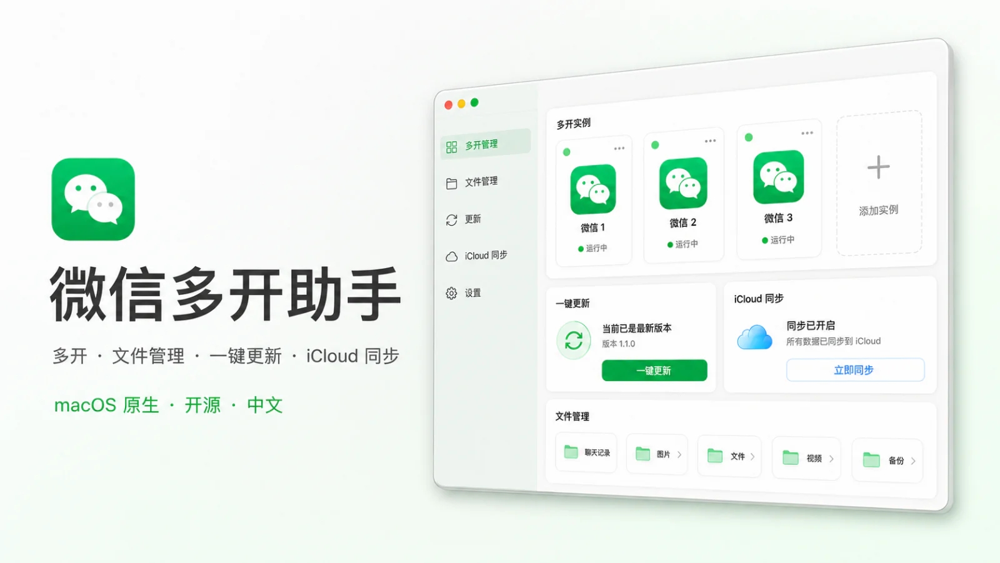

# 微信多开助手

开源的 macOS 微信多开与分身管理工具。



## 快速了解

**核心功能：让一台 Mac 同时登录多个微信账号。**

- 创建多个独立微信分身，每个分身登录一个账号。
- 微信升级后，一键更新所有分身，保留原有登录和聊天数据。
- 保存分身数量和名称，通过 iCloud 在新 Mac 上恢复方案。

兼容增强是可选功能。只想多开微信时，不需要安装增强。

### 安装

1. 从 [Releases](https://github.com/makerjackie/WeChatManager/releases/latest) 下载最新版 DMG。
2. 打开 DMG，将“微信多开助手”拖入“应用程序”。
3. 首次启动时，按提示完成两步权限设置。

支持 macOS 14 及以上，以及 Apple 芯片和 Intel Mac。

### 使用

1. 打开“分身管理”，点击“创建分身”。
2. 打开新分身，登录另一个微信账号。
3. 微信升级后，前往“方案与更新”一键更新全部分身。

### 使用前须知

- 本项目与腾讯、微信没有关联。
- 多开或修改微信客户端可能受到微信软件许可协议限制，请自行评估账号风险。
- 应用不读取或上传聊天记录；普通多开不会修改官方微信。
- 兼容增强会修改官方微信，但安装前会自动备份，并支持恢复。

---

## 详细说明

### 微信分身

每个分身使用独立名称、Bundle ID 和本地容器，可以分别登录不同账号。创建、更新或移除分身时，不会删除对应的聊天数据。

如果当前微信已被其他本机工具修改或重新签名，仍可按当前状态创建分身；第三方修改本身的兼容性由对应工具决定。

### 方案与更新

- 自动识别版本落后的分身，并一键更新到当前微信版本。
- 保存常用分身的数量和名称，避免微信升级后逐个重建。
- 通过 iCloud 同步方案；换 Mac 后可重新创建分身，只需重新扫码登录。
- iCloud 不同步聊天记录、登录状态或账号标识。

### 兼容增强

兼容增强不是普通多开的必需功能，目前仅支持已适配的微信版本和 Apple 芯片 Mac。

- **原生多开增强**：让“再开一个微信”更稳定。
- **保留已撤回消息**：对方撤回消息后，仍可在这台 Mac 上查看原消息。

应用显示“当前版本可以使用”时才能安装。暂不支持时，会直接给出推荐版本和下载入口。

当前推荐版本是微信 `4.1.5.28`（构建 `32288`）：优先使用[腾讯官方下载](https://dldir1.qq.com/weixin/Universal/Mac/xWeChatMac_universal_4.1.5.28_32288.dmg)，官方地址失效时再使用[历史版本备份](https://github.com/canc3s/wechat-versions/releases/tag/v4.1.5.28-mac)。

安装增强时，应用会：

1. 精确检查微信构建号和处理器架构。
2. 保存完整的微信应用备份。
3. 只安装用户选择的功能。
4. 验证修改结果和代码签名，失败时尝试恢复。

### 权限与隐私

- 首次启动只引导允许识别微信应用和管理应用。
- 只有安装兼容增强时才需要管理员授权。
- 应用不访问微信聊天文件目录，也不申请“访问其他 App 数据”权限。
- 不连接或控制腾讯服务器，不接入统计 SDK、广告 SDK 或远程日志平台。
- 网络仅用于软件更新、兼容配置和用户主动保存的 iCloud 方案。

## 本地开发

要求 Xcode 26、Swift 6 和 XcodeGen：

```bash
brew install xcodegen
xcodegen generate
xcodebuild test \
  -project WeChatManager.xcodeproj \
  -scheme WeChatManager \
  -destination 'platform=macOS'
```

项目使用 SwiftUI、Observation、Swift Concurrency、Security.framework 与 Sparkle 2。没有服务端组件。

## 发布

发布脚本会生成 Universal 2 Archive、Developer ID 导出包、公证 `.app`、可拖放安装的 DMG、DMG 公证票据和 Sparkle appcast：

```bash
scripts/release.sh 1.0.0 1
```

本机需要 Developer ID Application 证书、已登录的 `asc`，以及 Sparkle `generate_keys` 保存在钥匙串里的 EdDSA 私钥。

## 开源与致谢

本项目采用 [GNU AGPL-3.0](LICENSE) 开源。

- Mach-O 补丁思路与兼容数据来源：[sunnyyoung/WeChatTweak](https://github.com/sunnyyoung/WeChatTweak)，AGPL-3.0。
- 独立 Bundle ID 分身方案参考：[fzlzjerry/wechat-antirecall](https://github.com/fzlzjerry/wechat-antirecall)。本项目重新实现了适用于 GUI 管理的版本。
- 自动更新框架：[Sparkle](https://sparkle-project.org/)，MIT License。

完整第三方说明见 [THIRD_PARTY_NOTICES.md](THIRD_PARTY_NOTICES.md)。
